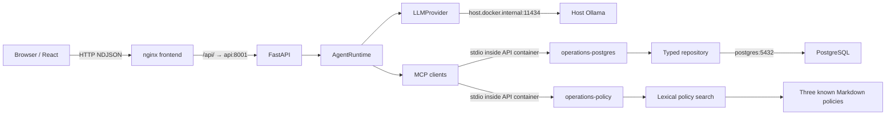

# Architecture

## System overview

A local operations assistant combines structured e-commerce facts and internal
policy rules using narrow MCP capabilities. The browser sees observable execution
events, not provider diagnostics or hidden reasoning.

## Components

| Component | Responsibility |
| --- | --- |
| React frontend | Task entry, NDJSON consumption, safe text rendering, tool trace, AbortController cancellation |
| FastAPI API | Request validation, run lifecycle, safe streaming errors, development CORS, DB health |
| AgentRuntime | Custom framework-independent agent harness core: bounded model/tool loop, discovered ownership routing, tool observations, failures, termination and observable events—not model reasoning |
| LLMProvider | Typed chat boundary; OllamaProvider maps discovered schemas and parses structured tool calls |
| OperationsMCPClient | Starts/discovers/invokes the operations stdio server; no repository imports |
| PolicyMCPClient | Starts/discovers/invokes the policy stdio server; no policy parsing |
| operations-postgres | Publishes six typed read-only capabilities; delegates queries and serializes Decimal safely |
| operations-policy | Publishes search_policy and source-bearing structured results |
| Repository layer | Validated, parameterized SQLAlchemy queries and shared product metric aggregation |
| PostgreSQL | Relational operational facts, constraints and indexed query access |
| Policy search layer | Known-file loading, heading sections, deterministic lexical ranking |
| Ollama | Host-managed local model inference; qwen2.5:7b is the measured default |

## Request lifecycle

1. User submits a task; frontend POSTs to FastAPI (through nginx in Compose).
2. API validates message/max_steps, enters a per-run resource context, and opens
   both MCP subprocess connections—even for a run that ultimately invokes no tools.
3. Runtime emits run_started, discovers schemas, validates expected capability
   sets, and builds a tool-name → owner map. Duplicate names abort before inference.
4. LLMProvider sends the user task, system instructions and discovered schemas to
   Ollama. The model selects structured tool calls or a final answer.
5. Runtime emits tool_started, invokes only an allowed name through its owning
   MCP client, and emits tool_completed or tool_failed.
6. Structured results/tool errors become tool-role observations for the next
   model turn. Multiple calls within one response execute sequentially.
7. A nonempty final answer emits answer then run_completed; failures terminate
   with a safe error event. Resource teardown closes clients/subprocesses.

Default max_steps is five model turns, configurable from one to ten. It does not
cap total tool calls per turn or total wall time. Tool failures allow model-led
correction; connection/provider failures terminate. There is no retry scheduler.

## MCP concepts

- MCP server = publishes capabilities and executes their implementation.
- MCP client = discovers/invokes capabilities through the protocol.
- Tool calling = the model selects a structured capability and arguments.
- Agent = the orchestration loop deciding what to do next with observations.

MCP is not the model or the agent. FastAPI REST serves the browser-facing app;
stdio MCP connects internal capability providers. Server schemas are discovered
rather than duplicated in the LLM layer. Typed result declarations at protocol
boundaries are intentional contracts, not copies of query logic.

## Data responsibilities

PostgreSQL provides structured operational facts: customers, products, orders,
order items and refunds. Policies provide operational rules, not facts about a
particular order. The model synthesizes observations; it is not a data authority.

Money uses NUMERIC and Python Decimal, serialized as strings. Date inputs are
inclusive UTC calendar dates; repository predicates use a half-open interval ending
at midnight after end_date. The shared product metric helper keeps ranking and
individual-product rate definitions consistent. Reason breakdown counts refunds
by request date; it is not automatically the same order cohort as rate analytics.

## Docker networking

Browser → localhost:5173 → frontend container port 80; nginx strips /api/ and
proxies to api:8001. API → postgres:5432 uses Compose DNS, not localhost.
API → host.docker.internal:11434 reaches host Ollama. Container-local health checks
correctly use loopback. MCP servers are subprocesses inside API, not services.

Host dev instead runs Vite and FastAPI locally, uses localhost:5432 for PostgreSQL
and localhost:11434 for Ollama. Linux has host-gateway mapping, but host listening
address/firewall compatibility is not fully verified. No domain-file bind mount
is required. Named-volume PostgreSQL persistence survives compose down.

## Streaming

NDJSON is one JSON event per newline. HTTP chunks need not align with events;
the browser buffers partial lines and validates parsed events. This streams tool
activity incrementally, not tokens of the final answer. nginx disables response
and request buffering, cache and proxy gzip, uses 300-second idle timeouts, and
does not ignore client disconnects. Client abort closes the upstream request;
shielded teardown protects MCP cleanup during cancellation.

Validation failures precede HTTP streaming. Once HTTP 200 is sent, terminal
failures arrive as error events. No run_completed is promised after an error.

## Security boundaries

- Typed read-only implementations constrain SELECT queries; no execute_sql exists.
- Strict discovered tool sets and unknown-name rejection constrain execution.
- Duplicate tool-name rejection prevents ambiguous ownership.
- Policy tools accept a query/filter, never a path; only known local files load.
- Agent and LLM layers have no database/repository/domain-file imports.
- Browser connects only to the app API, never Ollama, MCP or PostgreSQL.
- Tool observations and model output are untrusted data, not system authority.
  Tool content enters model context: no comprehensive prompt-injection defense
  or model-grounding verification is claimed.
- Safe HTTP errors omit dependency exception details; hidden reasoning is neither
  requested nor presented. The frontend renders final answers as plain text.
- MCP protocol stdout stays on private pipes; diagnostics use stderr.
- Backend image runs non-root; secrets/caches are excluded from builds.
- Read-only annotations describe tools; they are not a database permission system.
  Example credentials are not restricted to a dedicated SELECT-only role.

API health directly checks database connectivity outside the repository. Alembic,
seed/schema-check scripts and integration tests also access the DB intentionally.
These are maintenance/diagnostic paths, not agent-accessible capabilities.
MCP clients inspect paths only to launch modules, not to read domain data.

## Known architectural limitations

Local model grounding remains fallible; lexical retrieval is small-corpus-specific.
No auth/rate limiting, persistent sessions, retries, distributed tracing, TLS,
backup automation or production load validation. Each run starts two subprocesses
and their DB resources; concurrency limits and capacity planning are future work.
Ollama lifecycle is external. Python dependency ranges and base-image tags drift.
See [evaluation](evaluation.md) and [README limitations](../README.md#known-limitations).
